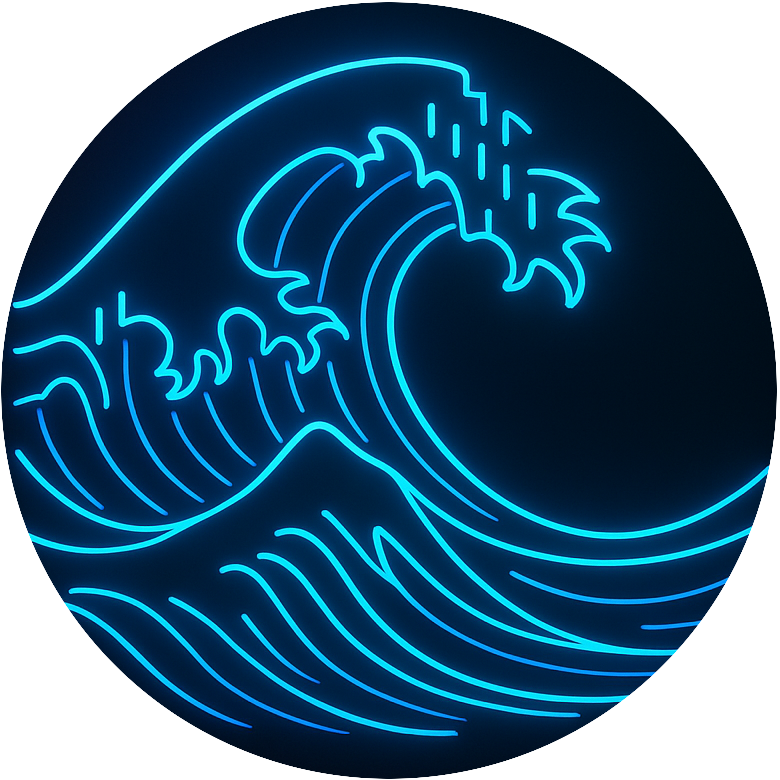
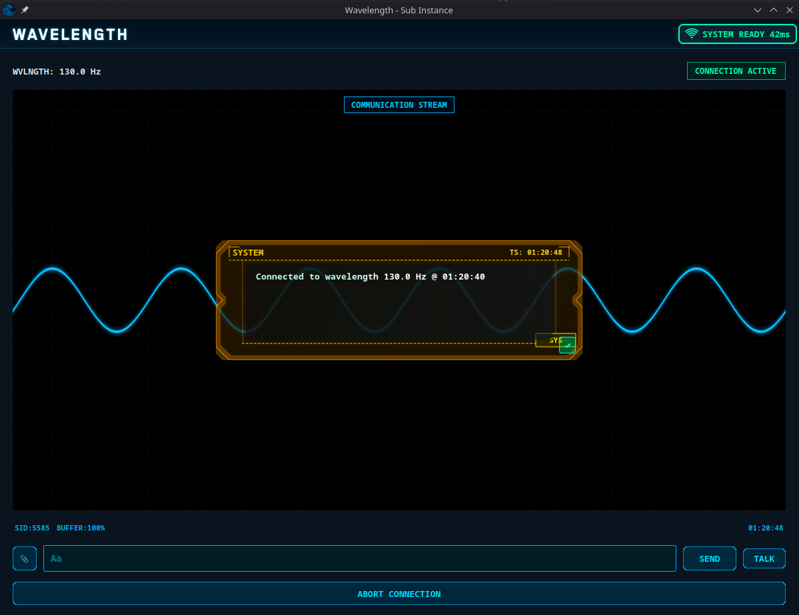
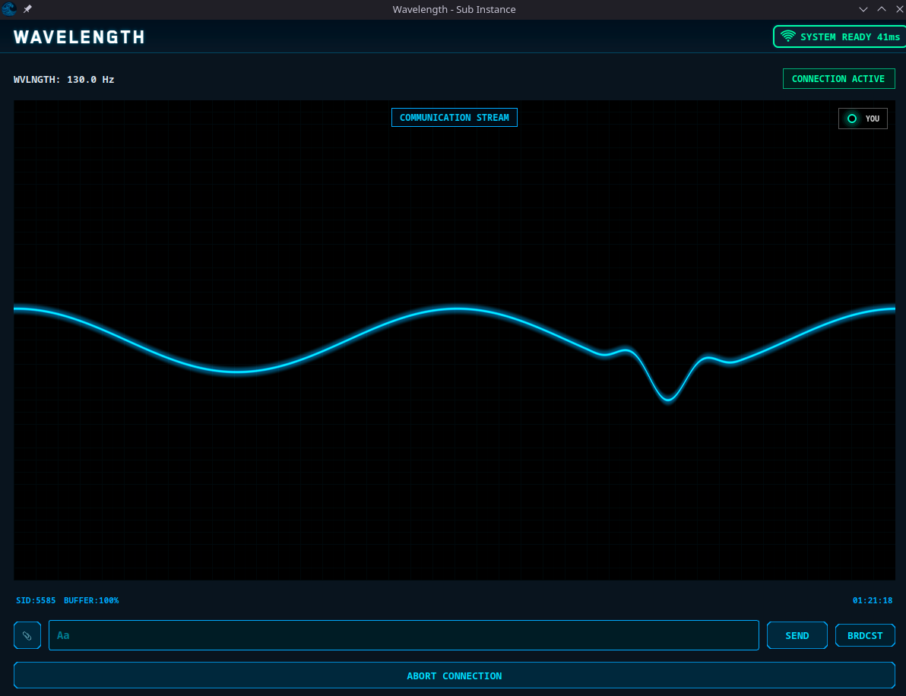
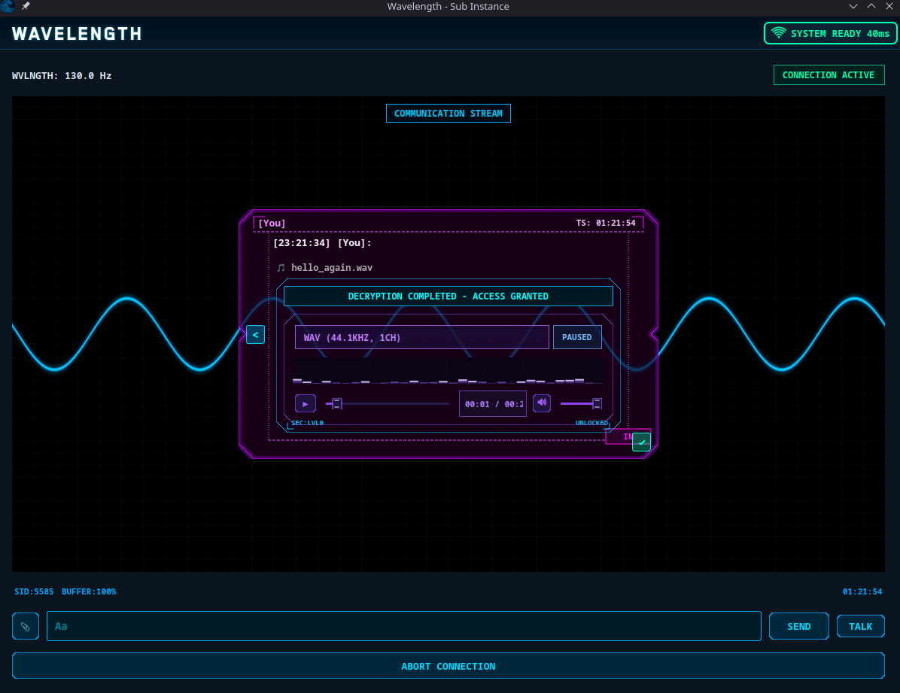
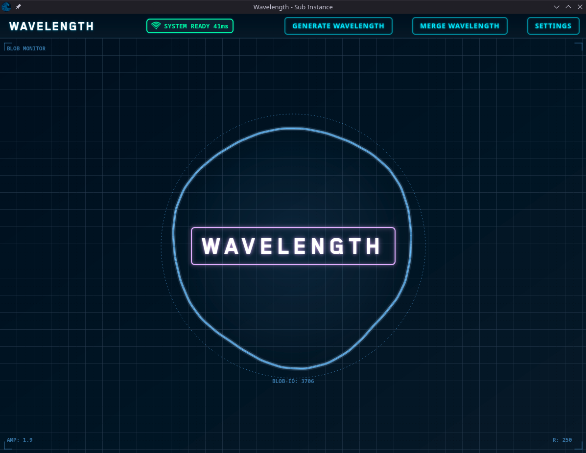
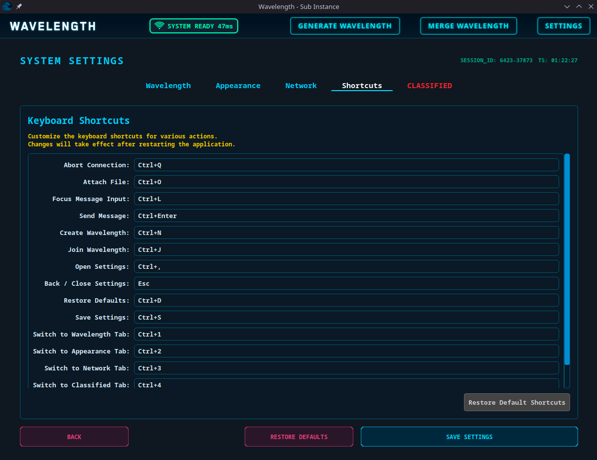

# Wavelength

<div style="display:flex; justify-content:center; margin:30px;">

</div>

### Next-Generation Communication System

Wavelength is an advanced, next-generation real-time communication system meticulously designed to facilitate seamless, secure, and intuitive information exchange. This project is a testament to continuous evolution, offering innovative solutions at the forefront of online interaction. Born from a deep understanding of modern communication needs, Wavelength aims to set new standards in digital connectivity, ensuring a robust and feature-rich platform for all your communication needs. It doesn't store any of your data. Really.

## 🌊 Why Choose Wavelength?

Wavelength transcends the typical chat application, evolving into a robust platform that prioritizes performance, flexibility, and groundbreaking innovation. It is engineered to provide users with an unparalleled communication experience, focusing on an environment that is not only intuitive and fast but also resilient and ready for future challenges. My commitment is to deliver a reliable and enjoyable communication tool that adapts to your needs, whether for casual conversations or demanding professional use. Wavelength represents the culmination of extensive research and development, aiming to redefine how we connect digitally.

## 🌟 Core Features

Wavelength is packed with features designed to enhance every aspect of your communication.
I've focused on delivering a rich, user-friendly experience, crafted from the ground up:

- **Sophisticated Text Chat:** Engage in reliable and lightning-fast text message exchanges through an intuitively designed interface. Wavelength ensures your conversations are smooth and efficient, supporting various formatting options to enrich your messages. The **Chat View** is the central hub for all text-based interactions, designed for clarity, readability, and ease of use, making long conversations effortless.
  

- **Advanced PTT (Push-To-Talk) System:** Experience fast and efficient voice communication, ideal for dynamic discussions and quick exchanges. The PTT system is optimized for exceptionally low latency, making it ideal for scenarios where instant voice communication is key, invited with walkie-talkies in mind. The feature integrates seamlessly into the chat view, providing a quick way to switch from text to voice with minimal effort.
  

- **Comprehensive Multimedia Support:** Effortlessly send and receive a wide array of file formats, including images, videos, and audio (_as of state of 11.06.25: no documents yet_). Wavelength handles multimedia content with ease, ensuring your files are delivered quickly and displayed correctly. The application's ability to preview and manage various media types directly within conversations streamlines sharing and enhances the interactive experience.
  

- **Intuitive User Interface (UI) & Navigation:** Crafted with user comfort and ease of use in mind, Wavelength's interface is clean, uncluttered, and highly responsive. Navigation is straightforward, allowing users to quickly find what they need without unnecessary complexity. The **Navigation Bar (Navbar)** provides quick access to different sections of the application, while the **Network Status Widget** keeps you informed about your connection stability and quality in real-time.
  

- **High Performance and Efficiency:** Optimized for fluid operation, Wavelength maintains high responsiveness even under intense usage scenarios with numerous active conversations and heavy data traffic. It's underlying architecture minimizes resource consumption while maximizing speed, ensuring a consistently smooth experience across various hardware configurations.

- **Extensive Customization Options:** Personalize your Wavelength experience to suit your preferences. From applying different themes and managing notification settings to defining specific UI elements, you have the granular control to tailor the application to your liking. This includes options managed by the **Appearance settings** and the **Shortcut Manager** for defining personalized keyboard shortcuts, enhancing user productivity and accessibility.
  

- **Astonishing _Joy_:** To create even more immersion, I've added _Joy_, which imitates the character _Joi_ from _Blade Runner_ movie. It's yours now.

<video src="https://github.com/user-attachments/assets/1253dc7f-7c4e-4006-875a-ce8aec678975" controls="controls" style="max-width: 730px;">
</video>


## 🏗️ Application Architecture & Core Components

Wavelength's robust architecture is built upon a foundation of well-structured components designed for scalability, maintainability, and efficiency. Each component plays a vital role in the application's overall functionality and performance.

- **System Initialization and Configuration:** The application's lifecycle begins with a robust initialization process managed by the `main()` function. This involves setting up core system parameters, loading configurations from sources or system registries, and ensuring a stable environment from the moment Wavelength launches. This crucial phase ensures proper resource allocation and foundational readiness for all subsequent operations.

- **Application Instance Management:** Wavelength employs sophisticated instance management to ensure seamless operation and efficient resource utilization.

  - **Instance Manager:** This core component acts as a central orchestrator, responsible for managing the lifecycle and intercommunication of various application modules. It ensures that services are properly initialized, accessible, and correctly handle dependencies, providing a single point of control for application-wide services.
  - **Font Manager:** Dedicated to handling all font-related operations, ensuring consistent typography throughout the UI. It allows for dynamic font adjustments and ensures that fonts are loaded and rendered efficiently for optimal readability.
  - **Shortcut Manager:** Provides a centralized system for managing and customizing keyboard shortcuts. This significantly enhances user productivity by allowing quick access to features and improves accessibility for users who prefer keyboard navigation or have specific ergonomic needs.
  - **Translation Manager:** Facilitates robust multi-language support, allowing the application to be easily localized into different languages. This manager dynamically loads and applies language packs, providing a seamless experience for users worldwide and simplifying future localization efforts.
    [SCREENSHOT HERE: (Optional) A block diagram illustrating the Instance Manager and its sub-managers (Font, Shortcut, Translation)]

- **Communication Architecture:** The backbone of Wavelength's real-time capabilities. This intricate system manages all aspects of message transmission, reception, and processing, ensuring reliable and secure data flow between users. The implementation of the **PTT System** (Push-To-Talk) is a key part of this architecture, handling efficient audio encoding, transmission, and decoding for voice communication. The entire communication stack is designed to handle high volumes of data with minimal latency and high throughput.

For an in-depth understanding of these architectural components, their specific roles, and their interdependencies, please refer to the **"Foundation of the Application"** and **"Communication Architecture"** sections in the accompanying [PDF](./wavelength.pdf).

## 🛠️ Underlying Technologies

Wavelength is built upon a foundation of best possible technologies, ensuring reliability, exceptional performance, and scalability. My choice of tools reflects our commitment to quality, efficiency, and future-proofing the application:

- **Qt5:** Yeah. I know Qt6 is available, but I've sticked to the 5th version. The powerful cross-platform application development framework serves as the backbone of Wavelength. It provides the necessary tools for creating rich graphical user interfaces, robust application logic, and handles low-level system interactions. Its extensive module ecosystem (Qt Core, Qt GUI, Qt Widgets, Qt Network, Qt Multimedia, Qt OpenGL, etc.) accelerates development and ensures broad platform compatibility across Windows, and Linux (none of the development was tested on macOS, if you are willing to take a shot, contant me :D).
- **OpenGL:** Utilized extensively for rendering high-quality graphics and ensuring a smooth visual experience across various devices. Its direct access to hardware capabilities allows for efficient and performant rendering of all visual elements within the application, contributing to its fluid and responsive interface.
- **FFmpeg:** An indispensable open-source library for handling and decoding diverse multimedia formats. Its robust capabilities for processing audio and video are crucial for Wavelength's seamless multimedia support, enabling efficient encoding, decoding, and streaming of various media types, ensuring compatibility with a wide range of files.
- **Other Essential Libraries and Frameworks:** A variety of other specialized libraries are integrated to handle specific functionalities such as secure network communication protocols (e.g., for data encryption), efficient data serialization (e.g., JSON parsing for configuration or API calls), cryptographic operations for security, and more, all contributing to the application's comprehensive feature set and robust performance.

A detailed overview of the technologies employed, their specific roles, and their application within the Wavelength project can be found in the **"Technologies"** section of the [PDF](./wavelength.pdf).

## 🚧 Challenges and Solutions

During the rigorous development of Wavelength, I encountered numerous technical challenges that demanded creative and robust solutions. Overcoming these hurdles has significantly contributed to the project's stability and sophistication, transforming obstacles into opportunities for innovation and demonstrating advanced problem-solving capabilities:

- **OpenGL Performance Optimization:** I tackled complex issues related to graphics rendering performance through meticulous shader optimization, efficient vertex reduction techniques, and the strategic implementation of caching mechanisms. These efforts were crucial in ensuring smooth visual experiences and maintaining high frame rates, even with intricate UI elements and dynamic content, preventing lag and ensuring a fluid user interface across various hardware configurations.

- **Thread Synchronization Management:** Ensuring flawless concurrent operations in a real-time communication system, where multiple tasks run simultaneously (e.g., UI updates, network I/O, audio processing), was paramount. I've implemented thread synchronization mechanisms utilizing mutexes, robust queues for inter-thread communication, and asynchronous operations. This approach effectively eliminated common concurrency issues such as starvation, livelocks, and deadlocks, guaranteeing stable and predictable multi-threaded execution.

- **Multimedia Support:** Integrating diverse multimedia capabilities, particularly with decoding various file formats, presented significant challenges. The adoption of the powerful FFmpeg library was a key strategic decision. Despite the myriad segmentation errors, memory leaks, and complex memory management issues initially encountered during FFmpeg integration, persistent debugging, extensive error handling, and refinement led to reliable and high-quality multimedia playback and transmission within the application.

- **Interface Consistency:** Maintaining a consistent and intuitive user experience across the entire application, despite its growing complexity and evolving feature set, was a core design principle. This was achieved by designing highly reusable UI components (e.g., custom buttons, input fields, message bubbles) and strictly adhering to consistent naming conventions and robust coding standards throughout the entire codebase, promoting maintainability, scalability, and a cohesive user experience that is easy to learn and use.

This project stands as one of the most rewarding and impactful endeavors I have undertaken, showcasing a deep understanding of complex software engineering principles and a commitment to quality. I am dedicated to its continued development and refinement, ensuring Wavelength remains at the cutting edge of communication technology.

For a more detailed technical dive into the specific challenges faced and the solutions implemented, please refer to the **"Issues and solutions"** section within the accompanying [PDF](./wavelength.pdf).

## ⚙️ System Requirements

To ensure optimal performance and a smooth user experience, please ensure your system meets the following minimum requirements. Meeting these specifications will provide the best Wavelength experience.

- **Operating System:** The one that supports GUI.
- **Processor:** The working one.
- **RAM:** 2 GB of RAM or more recommended for comfortable usage. 2 GB should be perfectly fine.
- **Graphics:** A dedicated or integrated graphics card with OpenGL 2.1 support or higher. Modern GPUs with OpenGL 3.3+ (or Vulkan/DirectX equivalents) are highly recommended for the best visual experience and hardware-accelerated rendering. This one is actually pretty neccessary for GPU acceleration through various of animations.
- **Network:** Stable internet connection is required for all real-time communication features (text chat, PTT, multimedia sharing).

The requirements are really low for today standards and that was exactly my goal.

## 🚀 Getting Started

Currently, there is only one way to use Wavelength on your system. It's by builing it from source.

### For Developers: Building Wavelength from Source

If you're a developer, want to contribute, or prefer to host and build the application yourself, follow these steps. This process gives you full control and allows for custom modifications.

#### Prerequisites for Building

Before you begin, ensure you have the following development tools and libraries installed on your system:

1.  **Git:** For cloning the repository.
    - [Download Git](https://git-scm.com/downloads)
2.  **CMake (version 3.16 or higher):** For managing the build process.
    - [Download CMake](https://cmake.org/download/)
3.  **Qt5 (version 5.x.x):** The core framework. You will need the development libraries for the following Qt modules: `Qt Core`, `Qt GUI`, `Qt Widgets`, `Qt Network`, and `Qt Multimedia` (including `Q5MultimediaWidgets`).
4.  **FFmpeg Development Libraries:** Essential for multimedia support (audio/video decoding, encoding, streaming). You'll need libraries like `libavcodec-dev`, `libavformat-dev`, `libavutil-dev`, etc.

    - **On Ubuntu/Debian:** `sudo apt update && sudo apt install libavcodec-dev libavformat-dev libavutil-dev`
    - **On Fedora:** `sudo dnf install ffmpeg-devel`
    - **On Windows:** This is more complex. You'll typically download pre-built FFmpeg development packages (e.g., from [Gyan.dev](https://www.gyan.dev/ffmpeg/builds/) or [BtbN](https://github.com/BtbN/FFmpeg-Builds/releases)), extract them, and then add their `bin` and `lib` directories to your system's PATH or include them directly in your project configuration.
      Using a package manager like MSYS2/vcpkg is often simpler, since my recommendation: **use** `vcpkg`.

5.  **C++ Compiler:** A C++20 compatible compiler toolchain installed for your operating system.
6.  **libpqxx** library - managing PostgreSQL database and connection.

After setting up everything, you should be able to just compile the cloned repo/code on your own machine. By default, Wavelength uses exterrnal server, so for a solitary experience, host your own server, by installing `Node` and neccessary packages from [server directory](./server/) - `npm i`.

Configuration of your own server can be provided via `Wavelength Settings` tab (in application), where you can paste your `server address` and `server port`.

#### ⚠️ Known Issues

I've currently found only one issue when using PTT in chat. The issue is only related to `Arch Linux` and `arch` based linuxes family, since they have very minimalistic pre-installed configurations. You need to properly configure **audio pipeline**.

```
sudo pacman -S pipewire-pulse pipewire-alsa pipewire-jack
```

```
systemctl --user restart pipewire pipewire-pulse wireplumber
```

Also, _Arch_ has some problems with audio buffers (again: lack of bunch of mostly default pre-installed audio codecs), so for using Arch (just like me: I use arch, btw.) it is advised to use `archlinux-audio-fix` branch.

Rest of the issues, enhancements and ideas for future or in development can be seen in [Issue](https://github.com/szymonwilczek/wavelength/issues) GitHub tab.

## 📚 Comprehensive Documentation

A thorough technical documentation of the Wavelength application, encompassing detailed diagrams, complete class descriptions, architectural insights, and API specifications, is available for developers and enthusiasts. This documentation is crucial for understanding the project's internal workings and contributing to its development.

- **Online Documentation:** [Click here](https://wavelength-docs.vercel.app/)
  This resource provides in-depth information about the application's structure, API, and internal workings, enabling a deeper understanding of the project.

## 📜 Source Code

Wavelength is an open-source project, and I wholeheartedly invite you to explore its codebase, contribute to its development, and report any issues you encounter. Your feedback, bug reports, and pull requests are invaluable to me in making Wavelength even better!

## 📄 License

This project is licensed under the **MIT License**. This permissive open-source license allows for broad use, modification, and distribution of the software, both for commercial and non-commercial purposes, with minimal restrictions.

_You can find the full text of the license in the [`LICENSE`](./LICENSE.md) file in the project's root directory._

## 👨‍💻 Author

**Szymon Wilczek**

Student at Silesian University of Technology, Faculty of Automation, Electronics and Computer Science.

The project was created for a semester credit in computer programming. The project is purely hobbyist.

---

Thank you for your interest in Wavelength! I sincerely hope you enjoy using and contributing to my next-generation communication application. Your journey towards seamless and innovative communication begins here.

---
